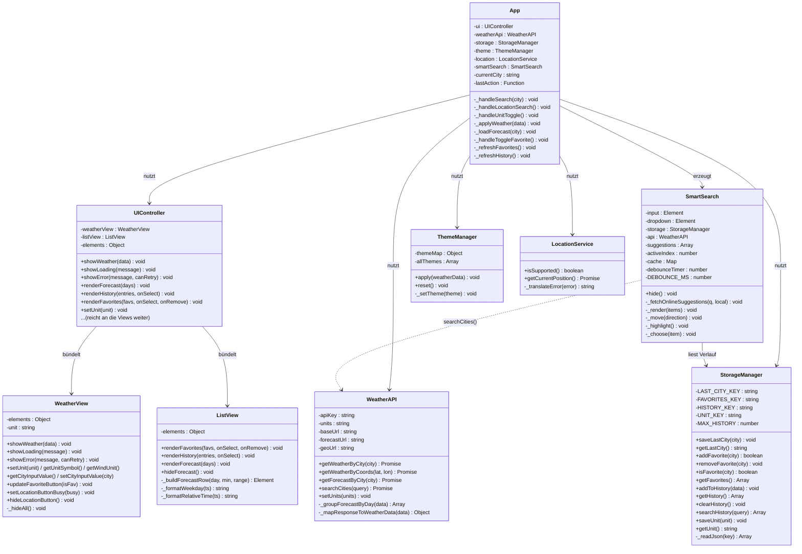
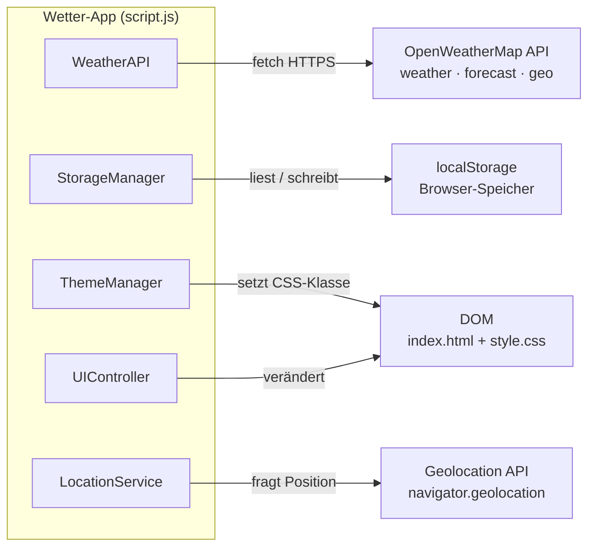
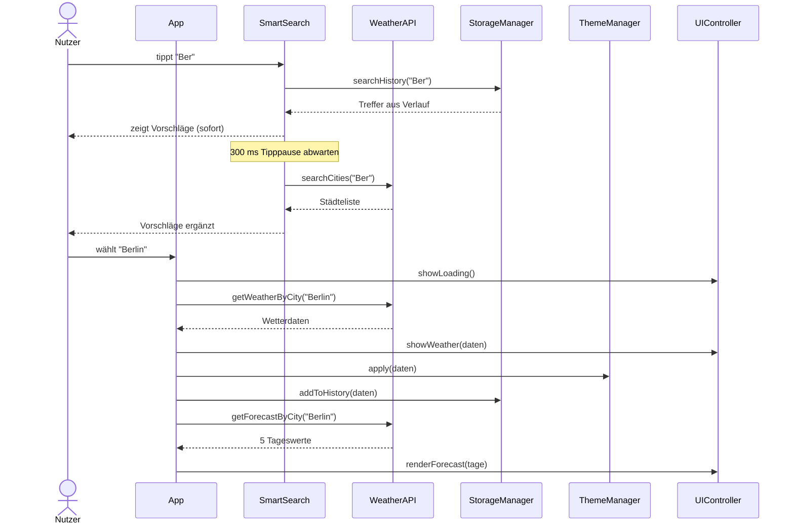

# UML-Klassendiagramm – Wetter-App

Die App besteht aus **9 Klassen** in `script.js`. `App` ist die zentrale
Steuerung und verbindet alle übrigen Klassen; die Fachklassen kennen
einander bewusst nicht (Ausnahme: `SmartSearch` liest den Verlauf und
nutzt die Städtesuche).

## Klassendiagramm

## Externe Schnittstellen

## Ablauf einer Suche (Sequenzdiagramm)

## Aufgabenverteilung im Diagramm

| Farbe | Person | Klassen |
|-------|--------|---------|
| 🔵 Blau | **Ahmad Serjawi** | `App`, `StorageManager`, `SmartSearch`, `ThemeManager`, `LocationService` |
| 🟢 Grün | **Cheyenne** | `WeatherView`, `ListView`, `UIController` (Anzeige & Design), HTML + CSS |
| 🟠 Orange | **Dilan** | `WeatherAPI` (API-Anbindung & Fehlerbehandlung) |
